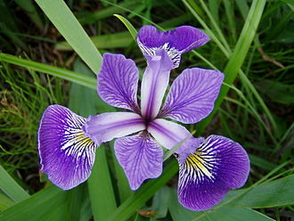
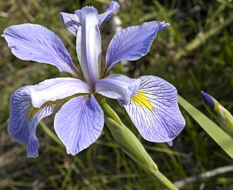
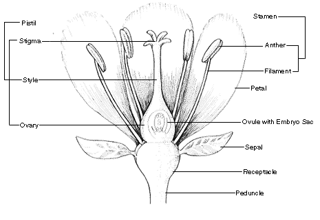
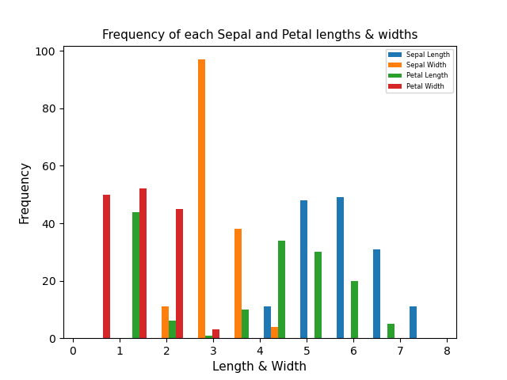

# pands-project
# *Program and Scripting Project - Fisher's Iris Data Set Analysis*
## Name: Ciaran Moran
## Email: G00426050@atu.ie
## Student ID: G00426050
## Year: 2023

 

### Initial Background Research

I had no idea what this dataset was all about. Before diving in headfirst to do the analysis and programming, it was imperative that I got an understanding of what this data means - to garner a real-world understanding of why it exists and where it came from. 
 
 From Wikipedia (1.1) and some informative YouTube videos (e.g. Great Learning 1.2) I discovered the following facts. The data originates from 1936 and was created a botanist and statistician Ronald Fisher. 
 
The data set is a collection of measurements of the sepal and petal of 3 varieties of the iris flower - Setosa, Virginica and Versicolor. The flowers were picked from the same field (in Quebec Canada) on the same day and by the same person using the same apparatus. 
 
<table>
<tr>
    <th>versicolor</th>
    <th>setosa</th>
    <th>virginica</th>
  </tr>
  <tr>
    <td>
    
    </td>
    <td>
    
    </td>
    <td>
    
    </td>
  </tr>
</table>

 
According to the American Museum of Natural History (1.3). 
The sepal is the outer green leaf-like part of the flower bud.  
The petal is the inner coloured part of the flower.	 
 

 

### What is the Iris Dataset? 

TODO: more info here

 

### Analysis of the Iris Dataset 

The following table shows the statistics of the iris data as provided by a dataframe .describe() method.

|       | Sepal_Length | Sepal_Width | Petal_Length | Petal_Width |
|:-----:|-------------:|------------:|-------------:|------------:|
| count |          150 |         150 |          150 |         150 |
|  mean |     5.843333 |    3.054000 |     3.758667 |    1.198667 |
|  std  |     0.828066 |    0.433594 |     1.764420 |    0.763161 |
|  min  |          4.3 |         2.0 |          1.0 |         0.1 |
|  25%  |          5.1 |         2.8 |          1.6 |         0.3 |
|  50%  |          5.8 |         3.0 |         4.35 |         1.3 |
|  75%  |          6.4 |         3.3 |          5.1 |         1.8 |
|  max  |          7.9 |         4.4 |          6.9 |         2.5 |

<table>
  <tr>
    <th>Histogram Sepal and Petal Lengths</th>
  </tr>
    <tr>
      <td>
        
      </td>
    </tr>
    <tr>
      <td>
      Here we have a histogram plot for the frequency of sepal and petal lengths. From this plot we can see that 
      </td>
    </tr>
  </table>

 

### Sources of Research\References

1.1 Wikipedia 
 
Wikipedia can be a very informative website for learning facts. 
 
This was my go-to for my initial reading about Fisher’s Iris Data Set. 
 
<a href="https://en.wikipedia.org/wiki/Iris_flower_data_set">Wikipedia- Iris flower data set</a> 

 
1.2 Great Learning on YouTube 
 
I discovered that many videos on YouTube just jumped in headfirst into the analysis of the data. No  
explanation as to where the dataset originated from, and what it actually means. 
 
This following video by “Great Learning” was an exception to that and provided good initial 
 
information and an understanding of what the dataset is all about. It includes pictures of the 3  
irises Setosa, Virginica and Versicolor (1:38). There are also pictures explaining what the 
 
measurements mean for the sepal and petal (2:15) 
 
Working With Iris.csv | Iris Data Set In Less Than 10 minutes | Great Learning 
 
https://www.youtube.com/watch?v=HXi9cl5Aq5w&ab_channel=GreatLearning

1.3 <a href="https://www.amnh.org">American Museum of Natural History</a>  
 
I used this information to learn what a sepal and petal are as I didn’t know the difference. 
 
<a href="https://www.amnh.org/learn-teach/curriculum-collections/biodiversity-counts/plant-identification/plant-morphology/parts-of-a-flower#:~:text=Sepal%3A%20The%20outer%20parts%20of,slender%20filament%20supporting%20the%20anther">Plant Morphology - Parts of a Flower</a>

W3 Schools
 
<a href="https://www.w3schools.io/file/markdown-introduction/">Markdown Tutorial</a>
 
<a href="https://www.w3schools.io/file/markdown-cheatsheet/">Markdown Cheatsheet</a>
 
<a href="https://www.w3schools.com/python/matplotlib_histograms.asp">Histogram Plots</a>
 
<a href="https://www.w3schools.com/python/matplotlib_scatter.asp">Scatter Plots</a>

Pandas
 
<a href="https://pandas.pydata.org/docs/reference/api/pandas.DataFrame.html">DataFrame</a>
 
<a href="https://www.w3schools.com/python/pandas/pandas_csv.asp">Pandas Read CSV</a>
 
<a href="https://pandas.pydata.org/docs/reference/api/pandas.DataFrame.drop.html">Remove columns from a DataFrame</a>

matplotlib.org
 
<a href="https://matplotlib.org/stable/tutorials/introductory/pyplot.html">Pyplot tutorial</a>
 

Seaborn
 
<a href="https://seaborn.pydata.org/tutorial/introduction.html">Seaborn Introduction</a>
 
<a href="https://seaborn.pydata.org/generated/seaborn.histplot.html">seaborn.histplot</a>
 
<a href="https://www.geeksforgeeks.org/python-seaborn-tutorial/l">GeeksForGeeks Seaborn Tutorial</a>
 
<a href="https://stackoverflow.com/questions/6282058/writing-numerical-values-on-the-plot-with-matplotlib">Fancy Seaborn Plot Example</a>

