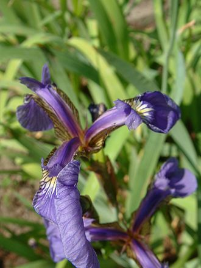
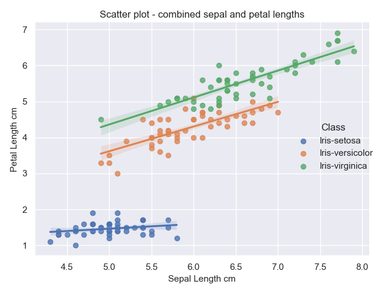
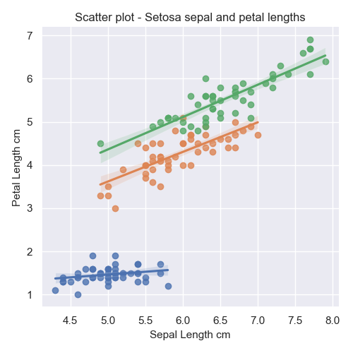
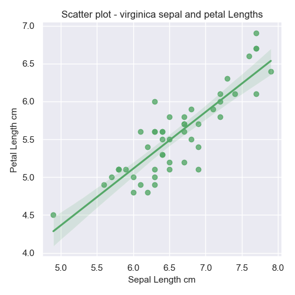
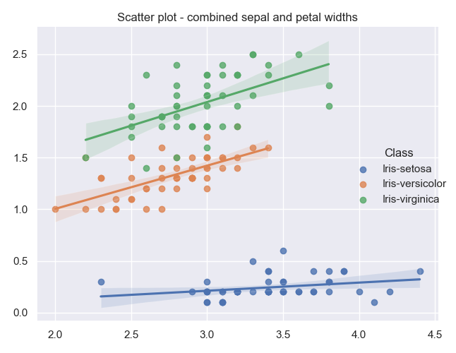
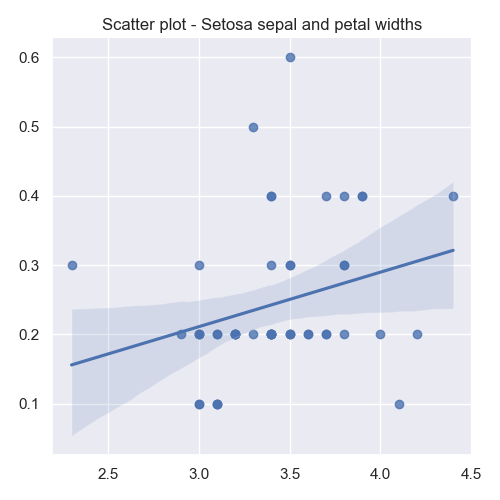
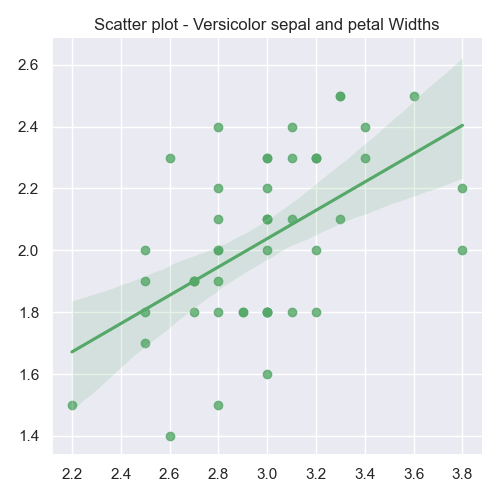

# pands-project
# *Program and Scripting Project - Fisher's Iris Data Set Analysis*
## Name: Ciaran Moran
## Email: G00426050@atu.ie
## Student ID: G00426050
## Year: 2023

 

### Initial Background Research

I had no idea what this dataset was all about. Before diving in headfirst to do the analysis and programming, it was imperative that I got an understanding of what this data means - to garner a real-world understanding of why it exists and where it came from. 
 
 From Wikipedia (1.1) and some informative YouTube videos (e.g. Great Learning 1.2) I discovered the following facts. The data originates from 1936 and was created by a botanist and statistician Ronald Fisher. 
 
The data set is a collection of measurements of the sepal and petal of 3 varieties of the iris flower - Setosa, Virginica and Versicolor. The flowers were picked from the same field (in Quebec Canada) on the same day and by the same person using the same apparatus. 

<table>
<tr>
    <th>versicolor</th>
    <th>setosa</th>
    <th>virginica</th>
  </tr>
  <tr>
    <td>
    
    </td>
    <td>
    
    </td>
    <td>
    
    </td>
  </tr>
</table>

 
According to the American Museum of Natural History (1.3). 
The sepal is the outer green leaf-like part of the flower bud.  
The petal is the inner coloured part of the flower.	 
 

 

The iris data is provided in a comma delimited csv file. As such this format isn't sufficient to perform analysis on. We therefore load this into a DataFrame, which converts it into a tabular format in memory. We can then perform many operations on this type of data, including sub-sets, sorting, statistics, plotting etc.

There are 150 rows of data. 50 rows for each of the 3 classes. 

There are three different class of irish included in the namely
<ol>
<li>setosa</li>
<li>versicolor</li>
<li>virginica</li>
</ol>

We are additionally provided with four different measurements for each class of iris:- 
<ol>
<li>sepal length (cm)</li>
<li>sepal width (cm)</li>
<li>petal length (cm)</li>
<li>petal width (cm)</li>
</ol>
 
The following data is representative of the csv data provided. The dataframe head and tail methods can be used for this purpose. The dataframe.head() method will display the top (n) rows of data (5 by default), and the dataframe.tail() methods will display the last (n) number of rows, again 5 by default.

<pre>
Dataset Head
------------
   Sepal_Length  Sepal_Width  Petal_Length  Petal_Width        Class
0           5.1          3.5           1.4          0.2  Iris-setosa
1           4.9          3.0           1.4          0.2  Iris-setosa
2           4.7          3.2           1.3          0.2  Iris-setosa
3           4.6          3.1           1.5          0.2  Iris-setosa
4           5.0          3.6           1.4          0.2  Iris-setosa
</pre>

<pre>
Dataset Tail
------------
     Sepal_Length  Sepal_Width  Petal_Length  Petal_Width           Class
145           6.7          3.0           5.2          2.3  Iris-virginica
146           6.3          2.5           5.0          1.9  Iris-virginica
147           6.5          3.0           5.2          2.0  Iris-virginica
148           6.2          3.4           5.4          2.3  Iris-virginica
149           5.9          3.0           5.1          1.8  Iris-virginica
</pre>

The following table shows the statistics of the iris data as provided by a dataframe .describe() method. This  provides descriptive statistics depending on the underlying data. In this case as it's numeric, we are provided with stats such as min, max and mean.
 
Here's a complete explanation of the information below for describe() as per <a href="https://www.w3schools.com/python/pandas/ref_df_describe.asp">W3Schools</a>
 
<pre>
count - The number of not-empty values.
mean - The average (mean) value.
std - The standard deviation.
min - the minimum value.
25% - The 25% percentile*.
50% - The 50% percentile*.
75% - The 75% percentile*.
max - the maximum value. 
</pre>

|       | Sepal_Length | Sepal_Width | Petal_Length | Petal_Width |
|:-----:|-------------:|------------:|-------------:|------------:|
| count |          150 |         150 |          150 |         150 |
|  mean |     5.843333 |    3.054000 |     3.758667 |    1.198667 |
|  std  |     0.828066 |    0.433594 |     1.764420 |    0.763161 |
|  min  |          4.3 |         2.0 |          1.0 |         0.1 |
|  25%  |          5.1 |         2.8 |          1.6 |         0.3 |
|  50%  |          5.8 |         3.0 |         4.35 |         1.3 |
|  75%  |          6.4 |         3.3 |          5.1 |         1.8 |
|  max  |          7.9 |         4.4 |          6.9 |         2.5 |

<h2>My personal observations of the iris data</h2>

The following represents my personal observations that I have formed whilst working with the data, and also viewing the graphs which I produced as per below.

<b>Class comparison of both sepal and petal widths and lengths</b>
 

Credit: Graph found on <a href="https://stackoverflow.com/questions/6282058/writing-numerical-values-on-the-plot-with-matplotlib">Stackoverflow</a> and changed by me for my iris dataframe.

This seaborn graph demonstrates a very useful holistic overview of the data as a whole. Each statictic is visualised in a contrasting fashion per class. 

This enables us to compare the 3 different classes of irish in the data - setosa, versicolor and virginica.  

We have 4 plots in the one image - sepal length, sepal width, petal length and petal width. From these 4 plots we can easily garner the following useful information, combined with the information from describe().

 
<u>Sepal Length</u>
 
<ul>
  <li>
    Virginica has the longest sepal length at 7.9cm
  </li>
  <li>
    Setosa has the shortest sepal length at 4.3cm
  </li>
  <li>
    Versicolor sits in the middle length wise, and would be representative of the mean of 5.84cm
  </li>
  <li>
    There is a relatively equal spread of variation of lengths across the 3 classes
  </li>
</ul>

 
<u>Sepal Width</u>
 
<ul>
  <li>
    Setosa has the widest sepal width at a max of 4.4cm
  </li>
  <li>
    Versicolor has the narrowest sepal width of a min of 2cm
  </li>
  <li>
    Virginica represents the middle of the road, the mean being 3.05cm
  </li>
  <li>
    Similar to the lengths, we see an equal spread of variation in width
  </li>
</ul>

 
<u>Petal Length</u>
 
<ul>
  <li>
    Virginica has the longest petal length, with a max of 6.9cm
  </li>
  <li>
    Setosa has the shortest with a min length of 1cm
  </li>
  <li>
    Versicolor is in the middle of the pack for petal length, the mean being 3.76cm
  </li>
  <li>
    Setosa has a very narrow spread of petal length, whilst the other 2 are more evenly spread 
  </li>
</ul>

 
<u>Petal Width</u>
 
<ul>
  <li>
    Setosa has the shortest petal width, the min being 0.1cm
  </li>
  <li>
    The longest petal width goes to Virginica, with a max of 2.5cm
  </li>
  <li>
    This then leaves Versicolor representing the moddle ground, with a mean of ~1.2cm
  </li>
  <li>
    Again we wee Setosa with a very narrow spread, whilst the other 2 are more evenly spread 
  </li>
</ul>

 
<h3>Observations per Class of iris</h3>
 
<u>Setosa</u>
 

Setosa is overall the smallest iris in the 3 types measured. It is also the most consistant in measurements, with a small variation to be seen in all measurements.

<u>Virginica</u>
 

Virginica then represents the larget of the 3 iris flowers. It also demonstrates the widest spread in all measurements. 

<u>Versicolor</u>
 

Versicolor sits in the middle ground. Its variations in measurements site between setosa and virginica. As does its petal/sepal lengths and widths.

 
 
<h3>Additional Graphs</h3>

The following are additional graphs reflecting my observations and opinion above.

There is a wide selection of histogram and scatter plots available for your persual. You will see that my above observations are also born out in these plots also.

 
<table>
  <tr>
    <th>Histogram Sepal and Petal Lengths</th>
  </tr>
    <tr>
      <td>
        
      </td>
    </tr>
    <tr>
      <td>
      Here we have a histogram plot for the frequency of sepal and petal lengths. From this plot we can see that 
      </td>
    </tr>
  </table>

 
  
  
  
  
  
  
  
  
  
  
  
  
  
  
  
  
  
  
  
  
  
  
  
  
  
  
  
  
  
  
  
  
  
  

### Sources of Research\References

1.1 Wikipedia 
 
Wikipedia can be a very informative website for learning facts. 
 
This was my go-to for my initial reading about Fisher’s Iris Data Set. 
 
<a href="https://en.wikipedia.org/wiki/Iris_flower_data_set">Wikipedia- Iris flower data set</a> 

 
1.2 Great Learning on YouTube 
 
I discovered that many videos on YouTube just jumped in headfirst into the analysis of the data. No  
explanation as to where the dataset originated from, and what it actually means. 
 
This following video by “Great Learning” was an exception to that and provided good initial 
 
information and an understanding of what the dataset is all about. It includes pictures of the 3  
irises Setosa, Virginica and Versicolor (1:38). There are also pictures explaining what the 
 
measurements mean for the sepal and petal (2:15) 
 
Working With Iris.csv | Iris Data Set In Less Than 10 minutes | Great Learning 
 
https://www.youtube.com/watch?v=HXi9cl5Aq5w&ab_channel=GreatLearning

1.3 <a href="https://www.amnh.org">American Museum of Natural History</a>  
 
I used this information to learn what a sepal and petal are as I didn’t know the difference. 
 
<a href="https://www.amnh.org/learn-teach/curriculum-collections/biodiversity-counts/plant-identification/plant-morphology/parts-of-a-flower#:~:text=Sepal%3A%20The%20outer%20parts%20of,slender%20filament%20supporting%20the%20anther">Plant Morphology - Parts of a Flower</a>

W3 Schools
 
<a href="https://www.w3schools.io/file/markdown-introduction/">Markdown Tutorial</a>
 
<a href="https://www.w3schools.io/file/markdown-cheatsheet/">Markdown Cheatsheet</a>
 
<a href="https://www.w3schools.com/python/matplotlib_histograms.asp">Histogram Plots</a>
 
<a href="https://www.w3schools.com/python/matplotlib_scatter.asp">Scatter Plots</a>
 
<a href="https://www.w3schools.com/python/pandas/ref_df_describe.asp">Pandas DataFrame describe() Method</a>
 
<a href="https://www.w3schools.com/python/matplotlib_subplot.asp">Matplotlib Subplot</a>

Pandas
 
<a href="https://pandas.pydata.org/docs/reference/api/pandas.DataFrame.html">DataFrame</a>
 
<a href="https://www.w3schools.com/python/pandas/pandas_csv.asp">Pandas Read CSV</a>
 
<a href="https://pandas.pydata.org/docs/reference/api/pandas.DataFrame.drop.html">Remove columns from a DataFrame</a>

matplotlib.org
 
<a href="https://matplotlib.org/stable/tutorials/introductory/pyplot.html">Pyplot tutorial</a>
 

Seaborn
 
<a href="https://seaborn.pydata.org/tutorial/introduction.html">Seaborn Introduction</a>
 
<a href="https://seaborn.pydata.org/generated/seaborn.histplot.html">seaborn.histplot</a>
 
<a href="https://www.geeksforgeeks.org/python-seaborn-tutorial/l">GeeksForGeeks Seaborn Tutorial</a>
 
<a href="https://stackoverflow.com/questions/6282058/writing-numerical-values-on-the-plot-with-matplotlib">Fancy Seaborn Plot Example</a>

